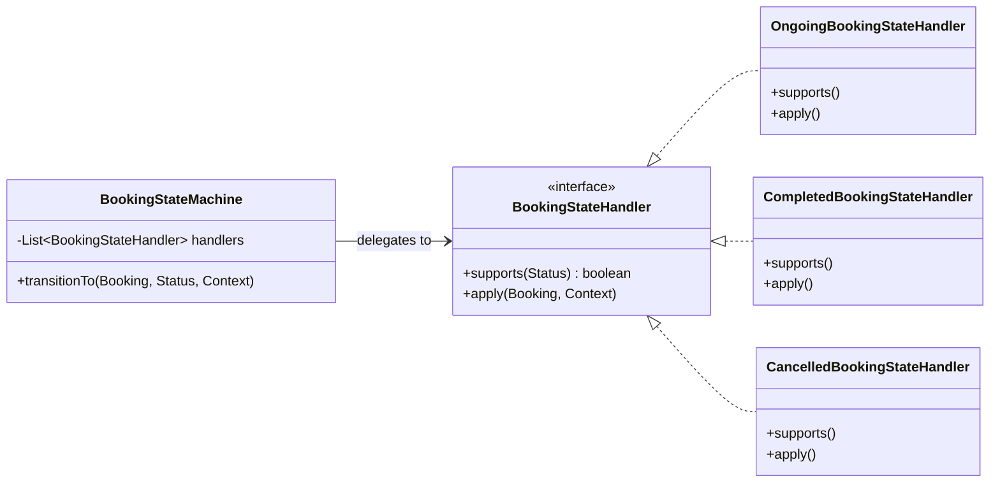

# Báo cáo Phân tích Design Patterns trong dự án XeNow

Dự án **XeNow** (Hệ thống quản lý thuê xe) được xây dựng trên nền tảng **Spring Boot (Java)** và áp dụng nhiều mẫu thiết kế (Design Patterns) kinh điển từ thiết kế hướng đối tượng (OO Design) đến các mẫu kiến trúc của Spring Framework. 

Dưới đây là chi tiết các Design Patterns được phát hiện trong mã nguồn của dự án:

---

## 1. Behavioral Patterns (Mẫu hành vi)

### 1.1. State Pattern (Mẫu trạng thái)
* **Mục đích:** Cho phép một đối tượng thay đổi hành vi của nó khi trạng thái nội bộ của nó thay đổi.
* **Vị trí áp dụng:** Package [bookingstate](file:///d:/CANH/m%E1%BA%ABu%20ph%E1%BA%A7n%20m%E1%BB%81m/XeNow/src/main/java/com/rental/bookingstate) để xử lý các trạng thái của Booking (Đặt xe) như: *Ongoing (Đang diễn ra)*, *Completed (Hoàn thành)*, *Cancelled (Đã hủy)*.
* **Chi tiết triển khai:**
  * **State Interface:** [BookingStateHandler](file:///d:/CANH/m%E1%BA%ABu%20ph%E1%BA%A7n%20m%E1%BB%81m/XeNow/src/main/java/com/rental/bookingstate/BookingStateHandler.java) định nghĩa phương thức `apply` và `supports` để xử lý trạng thái.
  * **Concrete States:** 
    * [OngoingBookingStateHandler](file:///d:/CANH/m%E1%BA%ABu%20ph%E1%BA%A7n%20m%E1%BB%81m/XeNow/src/main/java/com/rental/bookingstate/OngoingBookingStateHandler.java)
    * [CompletedBookingStateHandler](file:///d:/CANH/m%E1%BA%ABu%20ph%E1%BA%A7n%20m%E1%BB%81m/XeNow/src/main/java/com/rental/bookingstate/CompletedBookingStateHandler.java)
    * [CancelledBookingStateHandler](file:///d:/CANH/m%E1%BA%ABu%20ph%E1%BA%A7n%20m%E1%BB%81m/XeNow/src/main/java/com/rental/bookingstate/CancelledBookingStateHandler.java)
  * **Context / State Machine:** [BookingStateMachine](file:///d:/CANH/m%E1%BA%ABu%20ph%E1%BA%A7n%20m%E1%BB%81m/XeNow/src/main/java/com/rental/bookingstate/BookingStateMachine.java) quản lý việc chuyển trạng thái và tự động gọi Handler tương ứng.



---

### 1.2. Strategy Pattern (Mẫu chiến lược)
* **Mục đích:** Định nghĩa một tập hợp các thuật toán, đóng gói từng thuật toán lại, và làm cho chúng có thể thay thế lẫn nhau.
* **Vị trí áp dụng:** Package [license](file:///d:/CANH/m%E1%BA%ABu%20ph%E1%BA%A7n%20m%E1%BB%81m/XeNow/src/main/java/com/rental/license) được dùng để xác thực Giấy phép lái xe (GPLX) phù hợp với loại phương tiện (Ô tô, Xe máy) theo quy định pháp luật giao thông.
* **Chi tiết triển khai:**
  * **Strategy Interface:** [LicenseValidationStrategy](file:///d:/CANH/m%E1%BA%ABu%20ph%E1%BA%A7n%20m%E1%BB%81m/XeNow/src/main/java/com/rental/license/LicenseValidationStrategy.java) với phương thức `isValid` và `supports`.
  * **Concrete Strategies:**
    * [CarLicenseValidationStrategy](file:///d:/CANH/m%E1%BA%ABu%20ph%E1%BA%A7n%20m%E1%BB%81m/XeNow/src/main/java/com/rental/license/CarLicenseValidationStrategy.java) (xử lý logic bằng lái xe ô tô theo luật cũ và luật mới 2025).
    * [MotorbikeLicenseValidationStrategy](file:///d:/CANH/m%E1%BA%ABu%20ph%E1%BA%A7n%20m%E1%BB%81m/XeNow/src/main/java/com/rental/license/MotorbikeLicenseValidationStrategy.java) (xử lý logic bằng lái xe máy).
  * **Context:** [LicenseValidationService](file:///d:/CANH/m%E1%BA%ABu%20ph%E1%BA%A7n%20m%E1%BB%81m/XeNow/src/main/java/com/rental/license/LicenseValidationService.java) chứa danh sách các Strategy và tự động chọn chiến lược phù hợp dựa trên loại xe của Booking.

---

## 2. Structural Patterns (Mẫu cấu trúc)

### 2.1. Adapter Pattern (Mẫu thích ứng)
* **Mục đích:** Cho phép các interface không tương thích hoạt động cùng nhau bằng cách bọc interface của đối tượng sẵn có vào một interface mới.
* **Vị trí áp dụng:** Package [payment](file:///d:/CANH/m%E1%BA%ABu%20ph%E1%BA%A7n%20m%E1%BB%81m/XeNow/src/main/java/com/rental/payment) để tích hợp nhiều cổng thanh toán khác nhau (VietQR, VNPAY, Tiền mặt).
* **Chi tiết triển khai:**
  * **Target Interface:** [PaymentAdapter](file:///d:/CANH/m%E1%BA%ABu%20ph%E1%BA%A7n%20m%E1%BB%81m/XeNow/src/main/java/com/rental/payment/PaymentAdapter.java) định nghĩa cổng giao tiếp chung.
  * **Adapters:**
    * [VietQrPaymentAdapter](file:///d:/CANH/m%E1%BA%ABu%20ph%E1%BA%A7n%20m%E1%BB%81m/XeNow/src/main/java/com/rental/payment/VietQrPaymentAdapter.java) (thích ứng với API tạo mã VietQR từ img.vietqr.io).
    * [VnPayPaymentAdapter](file:///d:/CANH/m%E1%BA%ABu%20ph%E1%BA%A7n%20m%E1%BB%81m/XeNow/src/main/java/com/rental/payment/VnPayPaymentAdapter.java) (thích ứng với cổng thanh toán VNPAY).
    * `CashPaymentAdapter` (thanh toán bằng tiền mặt trực tiếp).
  * **Registry / Factory:** [PaymentAdapterRegistry](file:///d:/CANH/m%E1%BA%ABu%20ph%E1%BA%A7n%20m%E1%BB%81m/XeNow/src/main/java/com/rental/payment/PaymentAdapterRegistry.java) được dùng để đăng ký và lấy Adapter phù hợp theo phương thức thanh toán yêu cầu.

### 2.2. Facade Pattern (Mẫu mặt tiền)
* **Mục đích:** Cung cấp một interface đơn giản hóa cho một hệ thống con (subsystem) phức tạp gồm nhiều class.
* **Vị trí áp dụng:** Các dịch vụ thuộc lớp **Service Layer** trong package [service/impl](file:///d:/CANH/m%E1%BA%ABu%20ph%E1%BA%A7n%20m%E1%BB%81m/XeNow/src/main/java/com/rental/service/impl) (ví dụ: [BookingServiceImpl](file:///d:/CANH/m%E1%BA%ABu%20ph%E1%BA%A7n%20m%E1%BB%81m/XeNow/src/main/java/com/rental/service/impl/BookingServiceImpl.java)).
* **Chi tiết triển khai:**
  * `BookingServiceImpl` che giấu sự phức tạp của các thao tác nghiệp vụ đặt xe: gọi Repository để truy vấn dữ liệu, kiểm tra hợp lệ GPLX bằng `LicenseValidationService`, kiểm tra/áp dụng mã giảm giá Coupon, tạo giao dịch thanh toán thông qua `PaymentAdapterRegistry`, và chuyển đổi trạng thái bằng `BookingStateMachine`.
  * Các Controller chỉ cần gọi đến Service Facade này thay vì phải tự tương tác trực tiếp với hàng loạt các logic phức tạp trên.

### 2.3. Proxy Pattern (Mẫu ủy quyền)
* **Mục đích:** Cung cấp một đối tượng đại diện để kiểm soát quyền truy cập đến đối tượng thực tế hoặc bổ sung thêm hành vi.
* **Vị trí áp dụng:** Tích hợp sâu trong kiến trúc **Spring Framework** (Spring AOP, Spring Security).
* **Chi tiết triển khai:**
  * **@Transactional:** Khi một method trong `Service` được gắn `@Transactional`, Spring sẽ tạo ra một Dynamic Proxy bao quanh bean đó để tự động quản lý mở/đóng và commit/rollback Database Transaction.
  * **Spring Security Filter Chain:** Các request đi qua các Proxy filter để xác thực thông tin và kiểm tra quyền truy cập trước khi tới các Controller thực tế.

---

## 3. Creational Patterns (Mẫu khởi tạo)

### 3.1. Builder Pattern (Mẫu kiến tạo)
* **Mục đích:** Hỗ trợ xây dựng các đối tượng phức tạp một cách linh hoạt mà không cần tạo nhiều constructor khác nhau.
* **Vị trí áp dụng:** Toàn bộ các Entities trong package [entity](file:///d:/CANH/m%E1%BA%ABu%20ph%E1%BA%A7n%20m%E1%BB%81m/XeNow/src/main/java/com/rental/entity) và DTOs trong package [dto](file:///d:/CANH/m%E1%BA%ABu%20ph%E1%BA%A7n%20m%E1%BB%81m/XeNow/src/main/java/com/rental/dto).
* **Chi tiết triển khai:**
  * Sử dụng thư viện **Lombok** với annotation `@Builder` trực tiếp trên các Entity class (ví dụ: `Booking`, `Customer`, `Vehicle`, `User`,...) và các DTO class.
  * Giúp tạo dữ liệu mẫu dễ dàng trong [DataSeeder](file:///d:/CANH/m%E1%BA%ABu%20ph%E1%BA%A7n%20m%E1%BB%81m/XeNow/src/main/java/com/rental/config/DataSeeder.java) bằng cách gọi cú pháp fluent:
    ```java
    Booking booking = Booking.builder()
            .customer(customer)
            .vehicle(vehicle)
            .startDate(start)
            .endDate(end)
            .status(Booking.Status.Ongoing)
            .build();
    ```

### 3.2. Singleton Pattern (Mẫu đơn thể)
* **Mục đích:** Đảm bảo một class chỉ có duy nhất một instance và cung cấp điểm truy cập toàn cục cho nó.
* **Vị trí áp dụng:** Cơ chế quản lý **Spring Beans** mặc định của Spring IOC Container.
* **Chi tiết triển khai:**
  * Tất cả các class được đánh dấu `@Service`, `@Component`, `@Repository`, `@RestController` hay các bean được tạo từ `@Configuration` đều tồn tại dưới dạng Singleton duy nhất trong phạm vi Application Context.

---

## 4. Architectural & System Patterns (Mẫu kiến trúc & Hệ thống)

### 4.1. Dependency Injection (DI) / Inversion of Control (IoC)
* **Mục đích:** Đảo ngược quyền điều khiển việc khởi tạo dependencies, giảm sự phụ thuộc cứng nhắc giữa các class, tăng khả năng mở rộng và testability.
* **Vị trí áp dụng:** Xuyên suốt dự án. Các class sử dụng constructor injection kết hợp với Lombok `@RequiredArgsConstructor` để tự động inject các dependencies cần thiết (như Repository vào Service, Service vào Controller).

### 4.2. Repository (Domain/Data Access) Pattern
* **Mục đích:** Tạo một lớp trung gian giữa Business Logic Layer và Data Source, mô phỏng một tập hợp các đối tượng domain trong bộ nhớ.
* **Vị trí áp dụng:** Package [repository](file:///d:/CANH/m%E1%BA%ABu%20ph%E1%BA%A7n%20m%E1%BB%81m/XeNow/src/main/java/com/rental/repository).
* **Chi tiết triển khai:**
  * Các interface kế thừa `JpaRepository` từ Spring Data JPA giúp đóng gói logic truy xuất CSDL, loại bỏ hoàn toàn các mã boilerplate JDBC hay các câu lệnh SQL thủ công không cần thiết.

### 4.3. MVC (Model-View-Controller) Pattern
* **Mục đích:** Phân tách ứng dụng thành 3 thành phần chính: Model (Dữ liệu), View (Giao diện hiển thị - ở đây dự án đóng vai trò REST API cung cấp JSON cho Client tự hiển thị), và Controller (Điều hướng/Xử lý request).
* **Vị trí áp dụng:** Package [controller](file:///d:/CANH/m%E1%BA%ABu%20ph%E1%BA%A7n%20m%E1%BB%81m/XeNow/src/main/java/com/rental/controller).

### 4.4. DTO (Data Transfer Object) Pattern
* **Mục đích:** Đóng gói và truyền tải dữ liệu giữa các layer khác nhau nhằm tránh phơi bày trực tiếp cấu trúc CSDL thực tế (Entity) ra API bên ngoài, tối ưu hóa kích thước dữ liệu truyền tải.
* **Vị trí áp dụng:** Package [dto](file:///d:/CANH/m%E1%BA%ABu%20ph%E1%BA%A7n%20m%E1%BB%81m/XeNow/src/main/java/com/rental/dto).

---

## Tóm tắt & Đánh giá

| Nhóm Pattern | Tên Pattern | File/Package Minh Họa | Vai Trò trong XeNow |
| :--- | :--- | :--- | :--- |
| **Behavioral** | **State** | `com.rental.bookingstate` | Quản lý vòng đời và thay đổi nghiệp vụ theo trạng thái của Booking |
| | **Strategy** | `com.rental.license` | Chọn thuật toán kiểm tra bằng lái phù hợp với từng loại xe |
| **Structural** | **Adapter** | `com.rental.payment` | Kết nối và đồng bộ chuẩn dữ liệu với VietQR, VNPAY, v.v. |
| | **Facade** | `com.rental.service.impl` | Cung cấp cổng giao tiếp đơn giản từ Controller xuống hệ thống nghiệp vụ |
| | **Proxy** | Spring Framework (`@Transactional`) | Tự động chèn logic bổ sung (Transactions, Security Filters) |
| **Creational**| **Builder** | `com.rental.entity` / `com.rental.dto` | Khởi tạo nhanh và rõ ràng các đối tượng dữ liệu phức tạp |
| | **Singleton** | Spring Container | Đảm bảo mỗi Service/Repository chỉ được khởi tạo một instance duy nhất |
| **Architectural**| **Repository** | `com.rental.repository` | Tách biệt các tác vụ truy vấn cơ sở dữ liệu |
| | **MVC** | `com.rental.controller` | Phân phối luồng đi của API Request |
| | **DTO** | `com.rental.dto` | Lớp dữ liệu trung gian gửi nhận qua API |
